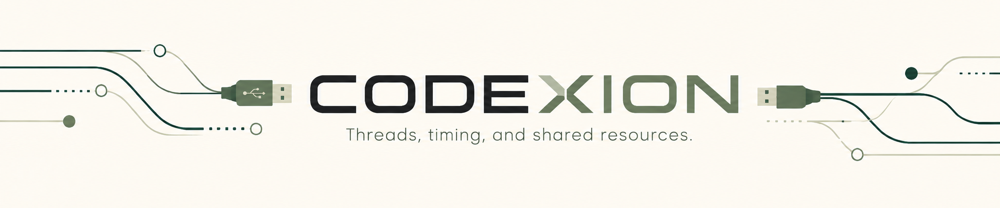

*This project has been created as part of the 42 curriculum by vslyunko*

<p align="center">
  
</p>

<p align="center">
  
  
  
  
</p>

<p align="center">
  A concurrent system simulation written in C 
</p>

## DESCRIPTION

Codexion is a C concurrency project where coders share USB dongles to compile, debug, and refactor. Each coder runs in its own thread and needs two dongles to compile. The challenge is to coordinate access fairly and safely using mutexes and FIFO or EDF scheduling.

The simulation stops when every coder reaches the required number of compilations or when a coder burns out from waiting too long to start compiling again.

---

## INSTRUCTIONS

**Prerequisites:** a C compiler, Make, POSIX threads, and optionally Valgrind on the Linux testing machine.


### Compilation

```bash
make
```
This creates the `codexion` executable.

### Running the proyet

Codexion expects **8 arguments**:

```bash
./codexion <number_of_coders> <time_to_burnout> <time_to_compile> <time_to_debug> 
<time_to_refactor> <number_of_compiles_required> <dongle_cooldown> <fifo|edf>
```

For example:

```bash
./codexion 5 10000 200 200 200 3 50 fifo
```
All time values are expressed in milliseconds. Numeric arguments must be non-negative integers, while coders must be greater than 0. The scheduler must be written exactly as fifo or edf.

Each log line shows: `<elapsed_time_ms> <coder_id> <activity>`.

### Makefile shortcuts

Other available rules:

```bash
make run        # Stat simulation using default ARGS
make clean      # Remove object files
make fclean     # Remove object files and executable
make re         # Recompile everything
make valgrind   # Detect memory errors and leaks
make helgrind   # Checks threading problems
```
Override the arguments for `run`, `valgrind`, or `helgrind` with `ARGS`:

```bash
make run ARGS="5 10000 200 200 200 3 50 edf"
```

The checks require Valgrind on Linux. They slow execution, so you may need to increase the burnout time.

---

## BLOCKING CASES HANDLED

**Deadlock prevention.** Coders acquire both dongles together or wait without holding either. This breaks *hold and wait*, one of Coffman's four conditions for deadlock. The scheduler mutex also serializes dongle locking, preventing threads from locking opposite ends of a pair at the same time. A single coder cannot acquire two dongles and waits for burnout instead.

**Starvation prevention.** Each request joins both dongles' queues with the same arrival order and burnout deadline. FIFO favors older requests; EDF favors the earliest deadline. A waiting request keeps its deadline while coders that start compiling receive later deadlines for future requests. This is the basis for preventing starvation under EDF when the timing parameters are feasible; impossible timings can still cause burnout.

**Dongle cooldown.** A released dongle records when it can be used again. Both dongles must be free and past their cooldown before a coder can claim them.

**Burnout detection.** A monitor checks the time since each coder's last compile started, with a roughly 1 ms pause between scans. The subject requires the burnout message within 10 ms of the deadline; this must be verified in timing tests. The simulation also stops once every coder reaches the compilation target.

**Log serialization.** A print mutex keeps each message on its own line, without output from other threads mixed into it.

## THREAD SYNCHRONIZATION MECHANISMS

The program uses `pthread_mutex_t` to protect shared data and `pthread_cond_t` to let coders wait for a change.

- **Dongle mutexes** protect each dongle's availability, cooldown, and queue while requests are checked or updated.
- **Coder mutexes** protect compile timestamps and counts. For example, a coder updates `last_compile_start` under the same `state_mutex` the monitor uses to read it, preventing concurrent unsynchronized access.
- **The scheduler mutex and condition variable** coordinate requests for both dongles. Waiting releases the scheduler mutex so other threads can make progress. `pthread_cond_timedwait` handles cooldown expiry; broadcasts notify waiting coders of releases or shutdown. After waking, each coder checks the conditions again before taking resources.
- **The end-state mutex** protects the shared stop flag. When the simulation ends, waiting coders are woken and running coders observe the flag through protected reads.
- **The print mutex** allows only one thread to write a log message at a time.

---

## RESOURCES

- [General overview of the Dining Philosophers problem](https://medium.com/@ruinadd/philosophers-42-guide-the-dining-philosophers-problem-893a24bc0fe2)

- [Threads introduction](https://www.youtube.com/watch?v=LOfGJcVnvAk)

- [Threads in C — practical example](https://www.youtube.com/watch?v=ldJ8WGZVXZk)

- [POSIX threads in C — main concepts playlist](https://www.youtube.com/watch?v=d9s_d28yJq0&list=PLfqABt5AS4FmuQf70psXrsMLEDQXNkLq2)

- [Condition variables in C](https://www.youtube.com/watch?v=ElXO5cGBDEs)

- [Signaling with condition variables (`pthread_cond_signal` / related concepts)](https://www.youtube.com/watch?v=br1rrHlv-pc&t=892s)

- [Heaps and priority queues — visual explanation](https://www.youtube.com/watch?v=XycnarZEBvQ)

- [Binary heap — insertion and deletion algorithms](https://www.youtube.com/watch?v=RtTlIvnBw10)

- [Deadlocks and Coffman conditions](https://www.youtube.com/watch?v=0sVGnxg6Z3k)

- [Philosophers guide — required functions and their roles](https://studylib.net/doc/27904987/philosophers-guide)

### AI usage

AI was used as a support tool throughout the project, mainly to clarify concurrency concepts, discuss program structure and file/function organization, improve naming, review possible bugs and edge cases, and help reason about synchronization and scheduling decisions.

It was also used for README wording and organization, small documentation corrections, and the creation of the project banner.